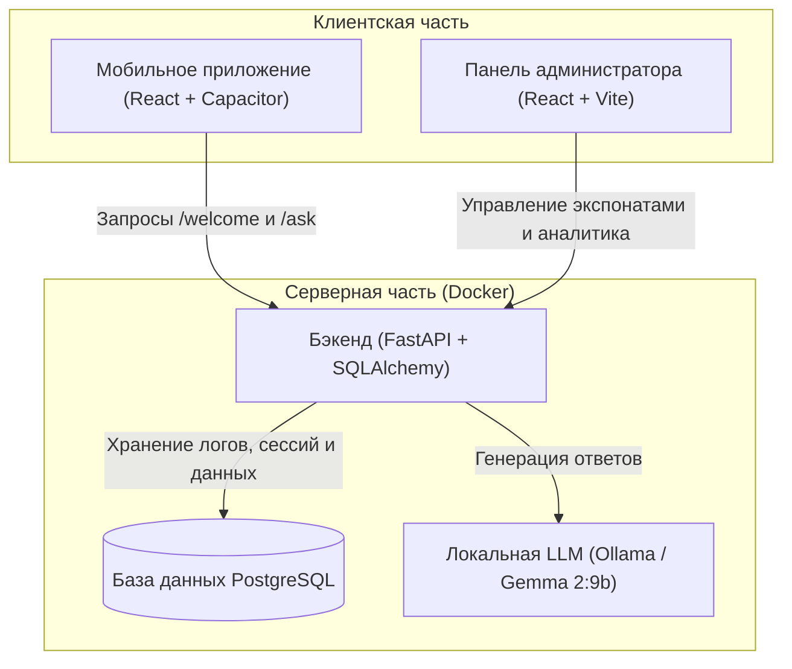

# MuseumAI — Умный Музейный Ассистент на базе ИИ

Программный комплекс для музеев, позволяющий посетителям сканировать QR-коды экспонатов и вести осмысленный диалог с виртуальным ИИ-гидом. 

---

## 📂 Архитектура и стек технологий

Проект состоит из трех основных компонентов, связанных между собой:



* **Серверная часть (`backend/`)**: API на **FastAPI (Python)**, взаимодействие с БД через **SQLAlchemy**, контейнеризация через **Docker**.
* **Панель администратора (`admin-panel/`)**: Веб-интерфейс на **React + TypeScript + Vite + TailwindCSS** для управления экспонатами, генерации QR-кодов и просмотра аналитики диалогов.
* **Мобильное приложение (`mobile-app/`)**: Гибридное мобильное приложение под Android на **React + Capacitor**. Использует аппаратный сканер QR-кодов, плагины для синтеза речи (TTS) и распознавания речи (Speech Recognition).

---

## 📋 Системные требования

Для запуска проекта на вашем компьютере должны быть установлены:

1. **Docker Desktop** (для запуска всего серверного стека: PostgreSQL, бэкенд, Ollama, панель администратора).
2. **Node.js** (версия 18 или выше) и пакетный менеджер **npm** (для сборки мобильного приложения).
3. **Java 21 JDK** (для сборки мобильного приложения в APK).

**Ресурсы для Ollama (модель `gemma2:9b`):**

| Режим | RAM | Диск | Примечание |
|-------|-----|------|------------|
| CPU (по умолчанию) | от 16 ГБ | ~6–8 ГБ на модель | Работает на любом ПК, ответы медленнее |
| GPU (опционально) | от 8 ГБ VRAM | то же | NVIDIA + WSL2/Linux, быстрее в разы |

> Отдельная установка Ollama на хост **не требуется** — нейросеть запускается в Docker-контейнере `ollama`.

---

## 🚀 Пошаговое руководство по развертыванию

### Шаг 1. Настройка и запуск серверной части (Docker)

#### 1.1. Создайте файл конфигурации

В корневой папке проекта скопируйте шаблон `.env.example` и создайте из него рабочий файл `.env`:

* **На Windows (PowerShell):**
  ```powershell
  Copy-Item .env.example .env
  ```
* **На Linux / macOS:**
  ```bash
  cp .env.example .env
  ```

#### 1.2. Настройте переменные в `.env`

Откройте `.env` в текстовом редакторе. Значения по умолчанию подходят для быстрого старта:

| Переменная | Описание | Значение по умолчанию |
|------------|----------|----------------------|
| `POSTGRES_USER` | Логин администратора БД в Docker. | `user` |
| `POSTGRES_PASSWORD` | Пароль администратора БД. | `secure_museum_password_2026` |
| `POSTGRES_DB` | Имя базы данных. | `museum` |
| `DATABASE_URL` | Строка подключения FastAPI к PostgreSQL. Хост `db` — имя сервиса в docker-compose. | `postgresql://user:secure_museum_password_2026@db/museum` |
| `JWT_SECRET_KEY` | Секретный ключ для JWT-токенов администратора. | `my_super_secret_jwt_key_for_museum_diploma_project` |
| `JWT_ALGORITHM` | Алгоритм шифрования JWT. | `HS256` |
| `JWT_ACCESS_TOKEN_EXPIRE_MINUTES` | Время жизни токена (минуты). | `1440` (24 часа) |
| `ADMIN_DEFAULT_LOGIN` | Логин администратора по умолчанию (создаётся при первом запуске). | `admin` |
| `ADMIN_DEFAULT_PASSWORD` | Пароль администратора по умолчанию. После первого входа меняется в панели. | `password123` |
| `ADMIN_DEFAULT_EMAIL` | Email администратора по умолчанию. | `admin@museum.ru` |
| `CORS_ALLOWED_ORIGINS` | Разрешённые URL клиентов через запятую. Добавьте локальный IP ПК для тестов с телефона. | `http://localhost:3000,...` |
| `OLLAMA_URL` | Адрес Ollama **внутри Docker-сети**. Не меняйте, если используете встроенный контейнер. | `http://ollama:11434` |
| `OLLAMA_MODEL` | Модель для скачивания и генерации ответов. | `gemma2:9b` |

> **Важно:** `OLLAMA_URL=http://ollama:11434` — это имя Docker-сервиса. Бэкенд обращается к Ollama по внутренней сети контейнеров, а не через `localhost`.

#### 1.3. Запустите все контейнеры

В корне проекта выполните:

```bash
docker compose up -d --build
```

Будут подняты сервисы:

| Сервис | Порт | Назначение |
|--------|------|------------|
| `db` | 5432 | PostgreSQL |
| `ollama` | 11434 | Локальная LLM |
| `ollama-pull` | — | Одноразовая загрузка модели (завершается сам) |
| `backend` | 8000 | FastAPI |
| `admin-panel` | 3000 | Панель администратора |
| `adminer` | 8080 | Веб-интерфейс БД |

#### 1.4. Дождитесь загрузки модели

При первом запуске сервис `ollama-pull` автоматически скачивает модель из `OLLAMA_MODEL`. Это может занять **5–20 минут** в зависимости от скорости интернета.

Следите за прогрессом:

```bash
docker compose logs -f ollama-pull
```

Когда в логах появится `success` или контейнер завершится — модель готова.

Проверьте, что модель установлена:

```bash
docker compose exec ollama ollama list
```

Ожидаемый вывод содержит строку `gemma2:9b` (или вашу модель из `.env`).

#### 1.5. Проверьте работоспособность

1. Откройте Swagger: `http://localhost:8000/docs`
2. Вызовите `GET /api/health` — оба поля должны быть `"ok"`:
   ```json
   {"database": "ok", "ollama": "ok"}
   ```
3. В панели администратора (`http://localhost:3000`) → **Аналитика** → блок **Статус системы**: зелёные индикаторы у БД и Ollama.

#### 1.6. Если модель не скачалась автоматически

Загрузите вручную:

```bash
docker compose exec ollama ollama pull gemma2:9b
```

Для более лёгкой модели (если мало RAM) измените в `.env`:

```env
OLLAMA_MODEL=gemma2:2b
```

и выполните `docker compose exec ollama ollama pull gemma2:2b`.

#### 1.7. GPU (NVIDIA)

В `docker-compose.yml` для сервиса `ollama` уже включён доступ к видеокарте:

```yaml
deploy:
  resources:
    reservations:
      devices:
        - driver: nvidia
          count: 1
          capabilities: [gpu]
```

**Требования:**
- NVIDIA GPU (у вас, например, RTX 3080 — подходит)
- Актуальные драйверы NVIDIA на Windows
- Docker Desktop → **Settings → Resources → GPU** — включена поддержка GPU

Проверка, что Ollama видит GPU:

```bash
docker compose logs ollama | findstr CUDA
```

Ожидаемая строка в логах: `library=CUDA ... NVIDIA GeForce RTX 3080`.

Если GPU нет или Docker не видит видеокарту — **закомментируйте** блок `deploy` в сервисе `ollama`, иначе контейнер не запустится.

После изменения GPU-настроек пересоздайте контейнер:

```bash
docker compose up -d ollama
```

#### 1.8. Альтернатива: Ollama на хосте (для разработки)

Если Ollama уже установлена на компьютере вне Docker, измените в `.env`:

```env
OLLAMA_URL=http://host.docker.internal:11434
```

И закомментируйте или удалите сервисы `ollama` и `ollama-pull` в `docker-compose.yml`, а также зависимость `backend` от `ollama`.

---

### Шаг 2. Панель администратора

Панель запускается автоматически в Docker на `http://localhost:3000`.

Для локальной разработки без пересборки контейнера:

1. `cd admin-panel`
2. `npm install`
3. `npm run dev` → `http://localhost:5173`

---

### Шаг 3. Сборка мобильного приложения (Android)

Для работы приложения на реальном телефоне бэкенд и телефон должны находиться в одной локальной сети (например, подключены к одному Wi-Fi).

1. **Узнайте локальный IP-адрес вашего компьютера:**
   * **На Windows:** Откройте командную строку и введите `ipconfig`. Найдите строку *IPv4-адрес* вашего беспроводного адаптера (например, `192.168.1.50`).
   * **На Linux / macOS:** Откройте терминал и введите `ip a` или `ifconfig`.

2. **Создайте файл конфигурации мобильного приложения:**
   Перейдите в папку `mobile-app/` и скопируйте шаблон `.env.example` в рабочий файл `.env`:
   * **На Windows (PowerShell):**
     ```powershell
     cd mobile-app
     Copy-Item .env.example .env
     ```
   * **На Linux / macOS:**
     ```bash
     cd mobile-app
     cp .env.example .env
     ```

3. **Настройте переменные в `mobile-app/.env`:**
   Откройте созданный файл `.env` в текстовом редакторе. Укажите IP-адрес вашего компьютера, который вы узнали на первом шаге:
   ```env
   # Укажите вместо 192.168.1.50 ваш реальный локальный IP
   VITE_API_URL=http://192.168.1.50:8000/api
   VITE_STATIC_URL=http://192.168.1.50:8000
   ```

4. **Установите зависимости и соберите веб-часть:**
   Находясь в папке `mobile-app/`, выполните:
   ```bash
   npm install
   npm run build
   ```

5. **Синхронизируйте проект с Android-платформой Capacitor:**
   ```bash
   npx cap sync android
   ```

6. **Соберите APK-файл:**
   * **Способ А (Через Android Studio — рекомендуется):**
     Откройте папку `mobile-app/android` в Android Studio. Дождитесь индексации проекта. В верхнем меню выберите **Build -> Build Bundle(s) / APK(s) -> Build APK(s)**. После завершения сборки нажмите *Locate* во всплывающем окне, чтобы найти файл.
   * **Способ Б (Через консоль):**
     Убедитесь, что у вас прописан путь к установленной Java JDK 21. Выполните сборку через Gradle-скрипт (на Windows):
     ```powershell
     $env:JAVA_HOME="C:\Program Files\Microsoft\jdk-21.0.11.10-hotspot"
     .\gradlew.bat assembleDebug
     ```
     Готовый файл приложения будет находиться по пути:
     `mobile-app/android/app/build/outputs/apk/debug/app-debug.apk`

---

## 🔐 Реквизиты доступа по умолчанию

После запуска контейнеров Docker вам доступны следующие сервисы:

* **Панель администратора**: `http://localhost:3000`
  * **Логин**: `admin`
  * **Пароль**: `password123` *(пароль можно изменить в панели после входа)*
* **Документация бэкенда (Swagger)**: `http://localhost:8000/docs`
* **Панель управления базой данных (Adminer)**: `http://localhost:8080`
  * **Движок (Система)**: PostgreSQL
  * **Сервер**: `db`
  * **Пользователь**: `user`
  * **Пароль**: `secure_museum_password_2026`
  * **База данных**: `museum`
* **Ollama API** (для отладки): `http://localhost:11434`

---

## 🔧 Устранение неполадок (Ollama)

| Симптом | Решение |
|---------|---------|
| `/api/health` → `"ollama": "error"` | Подождите 1–2 мин после старта. Проверьте: `docker compose ps` — сервис `ollama` должен быть `healthy`. |
| Модель не найдена | `docker compose exec ollama ollama pull gemma2:9b` |
| Ответы очень медленные | Нормально на CPU. Попробуйте `gemma2:2b` или включите GPU (см. шаг 1.7). |
| `ollama-pull` завершился с ошибкой | `docker compose logs ollama-pull` — часто проблема с интернетом. Повторите: `docker compose up ollama-pull` |
| Нехватка памяти | Увеличьте RAM в Docker Desktop (Settings → Resources → Memory → 16 GB+) или смените модель на `gemma2:2b`. |
| Пересоздать всё с нуля | `docker compose down -v` (удалит данные БД и модели!), затем `docker compose up -d --build` |

Полезные команды:

```bash
# Статус всех контейнеров
docker compose ps

# Логи Ollama в реальном времени
docker compose logs -f ollama

# Список загруженных моделей
docker compose exec ollama ollama list

# Тестовый запрос к модели напрямую
docker compose exec ollama ollama run gemma2:9b "Привет"
```

---

## 🔒 Безопасность

* **CORS:** Бэкенд использует белый список разрешённых источников вместо `*`. Свои адреса указывайте в `CORS_ALLOWED_ORIGINS`.
* **Лимит запросов:** Эндпоинты `/api/ask` и `/api/welcome` ограничены 10 запросами в минуту на IP для защиты от перегрузки нейросети. При превышении возвращается HTTP 429.
* **Авторизация:** Управление экспонатами, диалогами и аналитикой доступно только по JWT-токену администратора. Публичные эндпоинты для посетителей (`/api/welcome`, `/api/ask`, `/api/feedback`, `/api/exhibits/qr/{qr_code}`) авторизации не требуют.

---

## 💡 Демонстрационный сценарий использования (для защиты ВКР)

1. Откройте панель администратора (`http://localhost:3000`) и авторизуйтесь.
2. Перейдите в раздел **Экспонаты** и создайте новый экспонат (например, картину «Мона Лиза» Леонардо да Винчи с подробным описанием).
3. Нажмите кнопку **Печать QR-кода** и сохраните/распечатайте сгенерированный QR-код.
4. Запустите мобильное приложение на смартфоне (или эмуляторе), нажмите **Сканировать QR-код** и отсканируйте сгенерированный QR-код.
5. Приложение откроет чат-сессию и ИИ-гид поприветствует вас, рассказав базовую информацию об экспонате.
6. Задайте вопросы голосом (используя микрофон) или текстом (например, *«Какими красками написана эта картина?»* или *«В какой период она создавалась?»*).
7. Оцените работу ассистента с помощью лайка/дизлайка.
8. Перейдите в панели администратора во вкладки **Диалоги** и **Аналитика**, чтобы в реальном времени увидеть логи чата, среднее время генерации ответа и графики активности пользователей.
