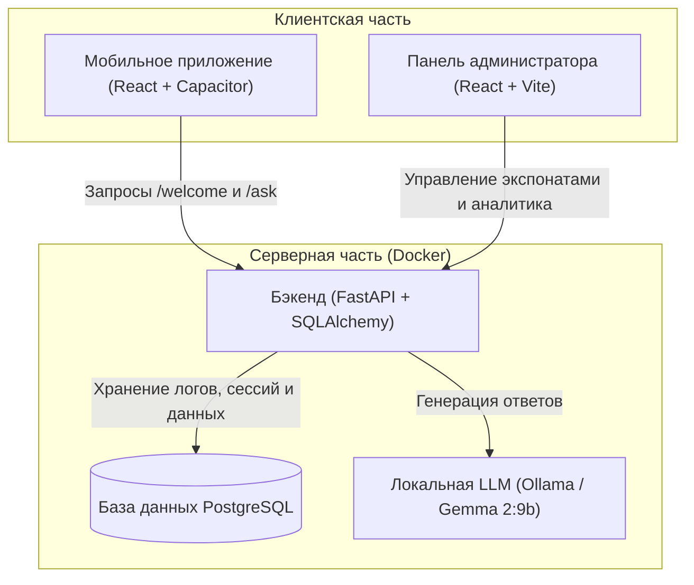

# MuseumAI — Умный Музейный Ассистент на базе ИИ

Программный комплекс для музеев, позволяющий посетителям сканировать QR-коды экспонатов и вести осмысленный диалог с виртуальным ИИ-гидом. 

---

## 📂 Архитектура и стек технологий

Проект состоит из трех основных компонентов, связанных между собой:



* **Серверная часть (`backend/`)**: API на **FastAPI (Python)**, взаимодействие с БД через **SQLAlchemy**, контейнеризация через **Docker**.
* **Панель администратора (`admin-panel/`)**: Веб-интерфейс на **React + TypeScript + Vite + TailwindCSS** для управления экспонатами, генерации QR-кодов и просмотра аналитики диалогов.
* **Мобильное приложение (`mobile-app/`)**: Гибридное мобильное приложение под Android на **React + Capacitor**. Использует аппаратный сканер QR-кодов, плагины для синтеза речи (TTS) и распознавания речи (Speech Recognition).

---

## 📋 Системные требования

Для запуска проекта на вашем компьютере должны быть установлены:
1. **Docker Desktop** (для запуска бэкенда и базы данных).
2. **Node.js** (версия 18 или выше) и пакетный менеджер **npm** (для сборки веб-частей).
3. **Java 21 JDK** (для сборки мобильного приложения в APK).
4. **Ollama** с установленной моделью `gemma2:9b` (запущенная локально на хост-машине).

---

## 🚀 Пошаговое руководство по развертыванию

### Шаг 1. Настройка и запуск бэкенда (Docker)

1. **Создайте файл конфигурации бэкенда:**
   В корневой папке проекта скопируйте шаблон `.env.example` и создайте из него рабочий файл `.env`:
   * **На Windows (PowerShell):**
     ```powershell
     Copy-Item .env.example .env
     ```
   * **На Linux / macOS:**
     ```bash
     cp .env.example .env
     ```

2. **Настройте переменные в созданном `.env`:**
   Откройте `.env` в текстовом редакторе и настройте параметры (значения по умолчанию подходят для быстрого старта в Docker):

   | Переменная | Описание | Пример значения / Значение по умолчанию |
   |------------|----------|-----------------------------------------|
   | `POSTGRES_USER` | Логин администратора БД в Docker-контейнере. | `user` |
   | `POSTGRES_PASSWORD` | Пароль администратора БД в Docker. | `secure_museum_password_2026` |
   | `POSTGRES_DB` | Имя создаваемой базы данных. | `museum` |
   | `DATABASE_URL` | Строка подключения FastAPI к PostgreSQL. Формат: `postgresql://пользователь:пароль@хост_бд/имя_бд`. Так как БД крутится в контейнере `db`, хостом указывается `db`. | `postgresql://user:secure_museum_password_2026@db/museum` |
   | `JWT_SECRET_KEY` | Секретный ключ для подписи токенов авторизации администраторов. Рекомендуется сгенерировать случайную строку. | `my_super_secret_jwt_key_for_museum_diploma_project` |
   | `JWT_ALGORITHM` | Алгоритм шифрования токенов JWT. | `HS256` |
   | `JWT_ACCESS_TOKEN_EXPIRE_MINUTES` | Время жизни токена сессии администратора в минутах. | `1440` (24 часа) |
   | `CORS_ALLOWED_ORIGINS` | Список разрешенных URL для запросов к API. Обязательно укажите адрес панели администратора и адрес мобильного приложения (включая локальный IP вашего компьютера для тестирования на реальном телефоне). | `http://localhost:3000,http://localhost:5173,http://localhost,capacitor://localhost,http://192.168.1.50:3000` |
   | `OLLAMA_URL` | Адрес, по которому бэкенд обращается к запущенной Ollama. `http://host.docker.internal:11434` позволяет контейнеру бэкенда обращаться к Ollama на вашем хост-компьютере. | `http://host.docker.internal:11434` |
   | `OLLAMA_MODEL` | Название установленной и запущенной в Ollama модели ИИ. | `gemma2:9b` (или `llama3`, `gemma:2b` и т.д.) |

3. **Соберите и запустите контейнеры:**
   В корне проекта выполните команду:
   ```bash
   docker-compose up -d --build
   ```
   Эта команда автоматически скачает образы PostgreSQL, Adminer, Nginx, соберет бэкенд-приложение и запустит их в фоновом режиме.

---

### Шаг 2. Развертывание панели администратора

Панель администратора собирается и запускается в Docker автоматически на порту `3000`. 
Если вам нужно запустить её локально для разработки:
1. Перейдите в папку `admin-panel/`: `cd admin-panel`
2. Установите зависимости: `npm install`
3. Запустите в режиме разработки: `npm run dev` (будет доступна по адресу `http://localhost:5173`)

---

### Шаг 3. Сборка мобильного приложения (Android)

Для работы приложения на реальном телефоне бэкенд и телефон должны находиться в одной локальной сети (например, подключены к одному Wi-Fi).

1. **Узнайте локальный IP-адрес вашего компьютера:**
   * **На Windows:** Откройте командную строку и введите `ipconfig`. Найдите строку *IPv4-адрес* вашего беспроводного адаптера (например, `192.168.1.50`).
   * **На Linux / macOS:** Откройте терминал и введите `ip a` или `ifconfig`.

2. **Создайте файл конфигурации мобильного приложения:**
   Перейдите в папку `mobile-app/` и скопируйте шаблон `.env.example` в рабочий файл `.env`:
   * **На Windows (PowerShell):**
     ```powershell
     cd mobile-app
     Copy-Item .env.example .env
     ```
   * **На Linux / macOS:**
     ```bash
     cd mobile-app
     cp .env.example .env
     ```

3. **Настройте переменные в `mobile-app/.env`:**
   Откройте созданный файл `.env` в текстовом редакторе. Укажите IP-адрес вашего компьютера, который вы узнали на первом шаге:
   ```env
   # Укажите вместо 192.168.1.50 ваш реальный локальный IP
   VITE_API_URL=http://192.168.1.50:8000/api
   VITE_STATIC_URL=http://192.168.1.50:8000
   ```

4. **Установите зависимости и соберите веб-часть:**
   Находясь в папке `mobile-app/`, выполните:
   ```bash
   npm install
   npm run build
   ```

5. **Синхронизируйте проект с Android-платформой Capacitor:**
   ```bash
   npx cap sync android
   ```

6. **Соберите APK-файл:**
   * **Способ А (Через Android Studio — рекомендуется):**
     Откройте папку `mobile-app/android` в Android Studio. Дождитесь индексации проекта. В верхнем меню выберите **Build -> Build Bundle(s) / APK(s) -> Build APK(s)**. После завершения сборки нажмите *Locate* во всплывающем окне, чтобы найти файл.
   * **Способ Б (Через консоль):**
     Убедитесь, что у вас прописан путь к установленной Java JDK 21. Выполните сборку через Gradle-скрипт (на Windows):
     ```powershell
     $env:JAVA_HOME="C:\Program Files\Microsoft\jdk-21.0.11.10-hotspot"
     .\gradlew.bat assembleDebug
     ```
     Готовый файл приложения будет находиться по пути:
     `mobile-app/android/app/build/outputs/apk/debug/app-debug.apk`

---

## 🔐 Реквизиты доступа по умолчанию

После запуска контейнеров Docker вам доступны следующие сервисы:

* **Панель администратора**: `http://localhost:3000`
  * **Логин**: `admin`
  * **Пароль**: `password123` *(пароль можно изменить в панели после входа)*
* **Документация бэкенда (Swagger)**: `http://localhost:8000/docs`
* **Панель управления базой данных (Adminer)**: `http://localhost:8080`
  * **Движок (Система)**: PostgreSQL
  * **Сервер**: `db`
  * **Пользователь**: `user`
  * **Пароль**: `secure_museum_password_2026`
  * **База данных**: `museum`

---

## 💡 Демонстрационный сценарий использования (для защиты ВКР)

1. Откройте панель администратора (`http://localhost:3000`) и авторизуйтесь.
2. Перейдите в раздел **Экспонаты** и создайте новый экспонат (например, картину «Мона Лиза» Леонардо да Винчи с подробным описанием).
3. Нажмите кнопку **Печать QR-кода** и сохраните/распечатайте сгенерированный QR-код.
4. Запустите мобильное приложение на смартфоне (или эмуляторе), нажмите **Сканировать QR-код** и отсканируйте сгенерированный QR-код.
5. Приложение откроет чат-сессию и ИИ-гид поприветствует вас, рассказав базовую информацию об экспонате.
6. Задайте вопросы голосом (используя микрофон) или текстом (например, *«Какими красками написана эта картина?»* или *«В какой период она создавалась?»*).
7. Оцените работу ассистента с помощью лайка/дизлайка.
8. Перейдите в панели администратора во вкладки **Диалоги** и **Аналитика**, чтобы в реальном времени увидеть логи чата, среднее время генерации ответа и графики активности пользователей.
